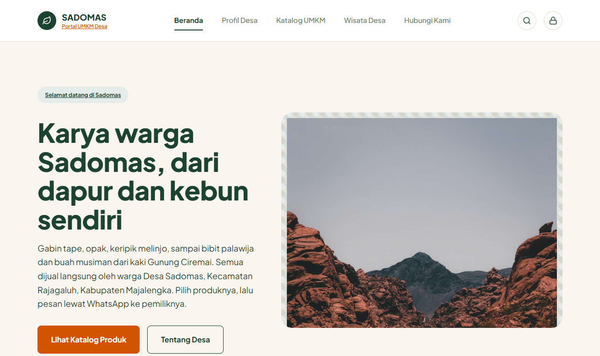
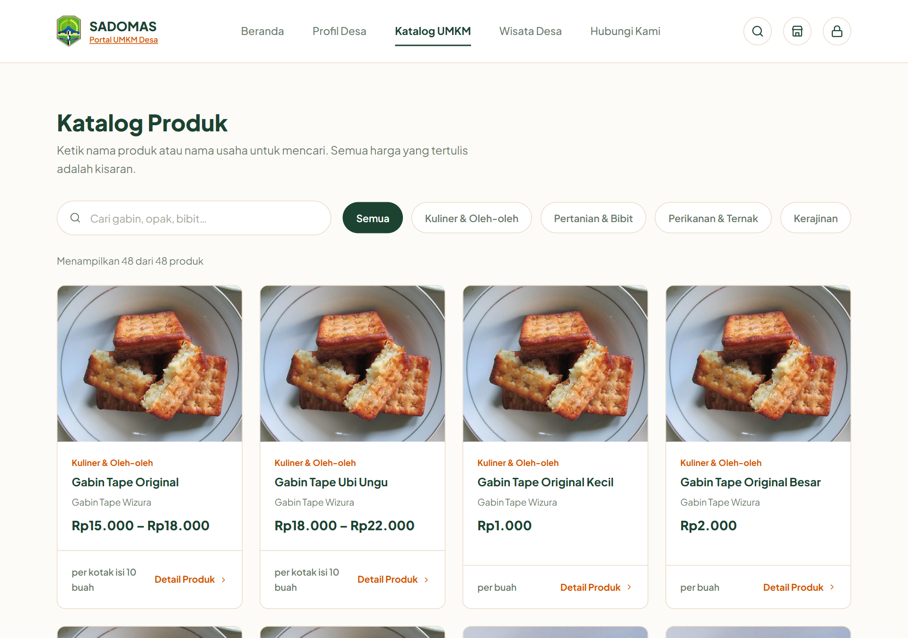
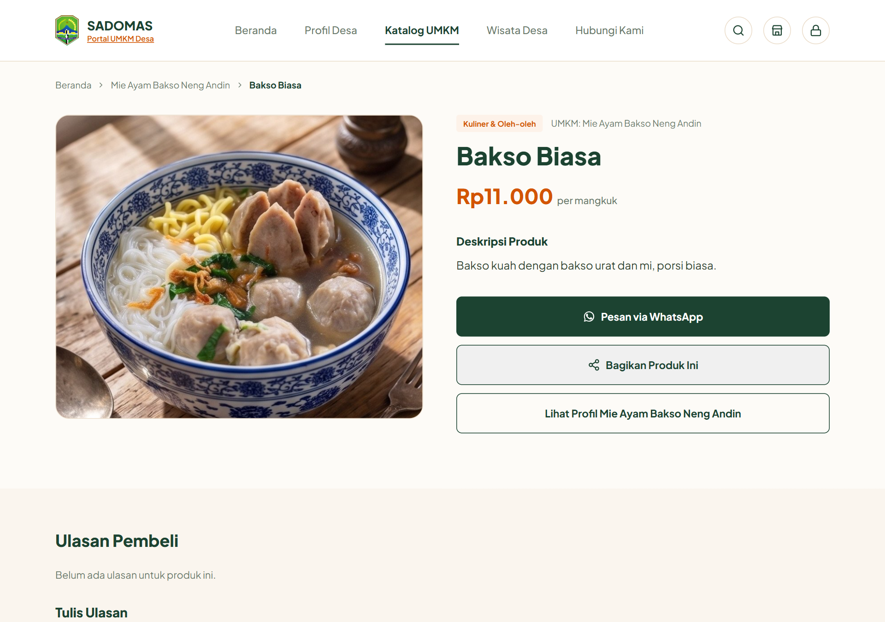
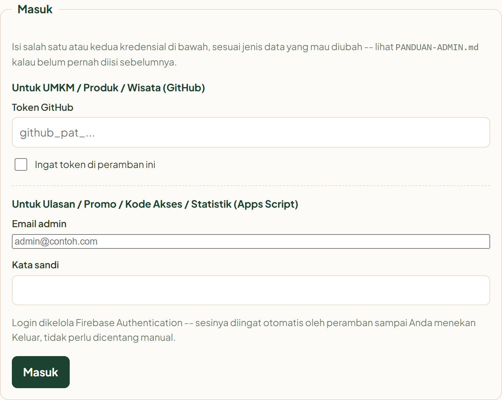
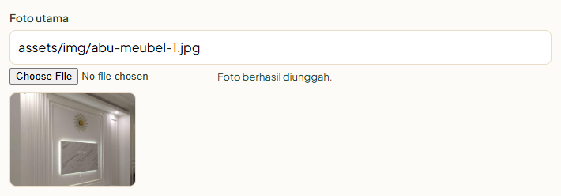
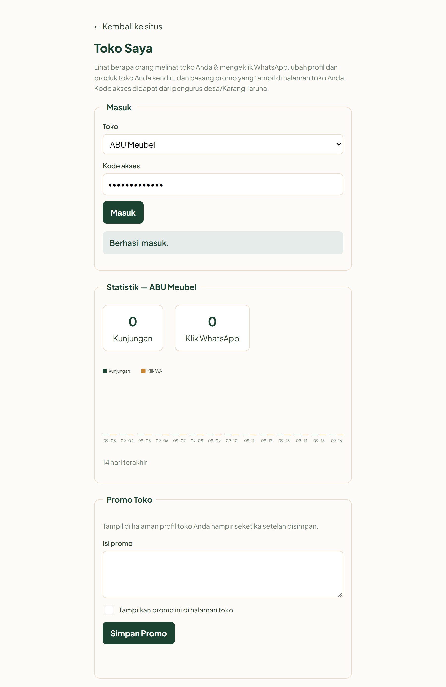

BUKU PANDUAN PENGGUNAAN

KATALOG UMKM

WEBSITE ETALASE PRODUK UMKM DESA SADOMAS

LOGO KKM DESA SADOMAS

<b>Kuliah Kerja Mahasiswa &mdash; Universitas Muhammadiyah Cirebon</b>

Desa Sadomas, Kecamatan Rajagaluh, Kabupaten Majalengka

Tahun 2026

Alamat situs: <code>https://umkmdesasadomas.web.id/</code>

# 1. Tentang Katalog UMKM Sadomas

Katalog UMKM Sadomas adalah sebuah situs etalase: ia memajang profil pelaku usaha desa beserta produk yang dijualnya, agar dapat ditemukan orang dari luar desa. Selama ini produk UMKM Sadomas dipasarkan dari mulut ke mulut, sehingga jangkauannya berhenti di batas desa. Situs ini memindahkan etalase itu ke internet, tanpa mengubah cara warga berjualan.

Yang perlu dipahami sejak awal: situs ini **tidak memproses pesanan**. Ia mempertemukan, lalu menyingkir. Pembeli yang tertarik menekan satu tombol, dan percakapannya pindah ke WhatsApp pemilik usaha. Harga, ongkos kirim, dan kesepakatan tetap diurus langsung oleh penjual dan pembeli seperti biasa.

## Tiga bagian yang dikelola

| Bagian | Yang dikelola |
| --- | --- |
| UMKM | Profil usaha: nama, pemilik, nomor WhatsApp, alamat, jam buka, dan foto. |
| Produk | Barang atau jasa tiap UMKM, lengkap dengan harga dan fotonya. |
| Wisata Desa | Destinasi wisata Sadomas yang ditampilkan pada halaman tersendiri. |

<b>Satu data usaha dipakai di banyak tempat</b>

Nama, nomor WhatsApp, dan foto sebuah UMKM cukup diisi satu kali di menu UMKM. Data itulah yang dipakai ulang oleh halaman produk, tombol pesan, dan halaman Toko Saya milik usaha tersebut.

Karena itu, memperbaiki nomor WhatsApp yang salah cukup dilakukan di satu tempat, dan seluruh halaman ikut benar.

# 2. Alamat dan Cara Membuka

Situs ini dibuka lewat peramban biasa, seperti Chrome di Android atau Safari di iPhone. Tidak ada aplikasi yang wajib dipasang, dan pengunjung tidak perlu mendaftar akun.

<figure class="gambar-panduan"><figcaption class="keterangan-gambar">Tampilan beranda situs. Ikon gembok di pojok kanan atas (sebelah ikon cari) adalah jalan pintas menuju halaman admin.</figcaption></figure>

| Siapa | Alamat yang dibuka | Perlu apa |
| --- | --- | --- |
| Pengunjung dan pembeli | `https://umkmdesasadomas.web.id/` | Tidak perlu apa-apa |
| Pengurus desa dan Karang Taruna | `admin.html` pada situs yang sama, atau tekan ikon gembok di pojok kanan atas tiap halaman | Token GitHub (untuk UMKM/Produk/Wisata) dan/atau Email + Kata Sandi akun admin (untuk Ulasan/Promo/Kode Akses/Statistik) &mdash; lihat Bagian 7 |
| Pemilik UMKM mitra | `toko-saya.html` pada situs yang sama | Kode akses toko masing-masing |

<b>Halaman admin bisa ditemukan siapa saja, login-nya yang menjaga</b>

Berbeda dari yang mungkin terdengar di tempat lain, alamat halaman admin TIDAK dirahasiakan &mdash; ada ikon gembok yang menautkannya di kepala setiap halaman situs. Yang benar-benar mencegah orang asing mengubah data adalah dua gerbang terpisah: Token GitHub pribadi admin (untuk UMKM/Produk/Wisata), dan login Firebase Authentication berupa akun email + kata sandi (untuk Ulasan/Promo/Kode Akses/Statistik) yang diperiksa ulang oleh Apps Script setiap kali ada yang menyimpan perubahan (lihat Bagian 8 dan bagian keamanan di <code>PANDUAN-ADMIN.md</code>).

## Memasang situs ke layar utama telepon

Situs dapat ditaruh di layar utama telepon sehingga terlihat dan terbuka seperti aplikasi, tanpa melalui Play Store.

| Perangkat | Langkahnya |
| --- | --- |
| Android (Chrome) | Tekan menu titik tiga di pojok kanan atas, pilih **Tambahkan ke Layar Utama**, lalu **Instal**. |
| iPhone (Safari) | Tekan ikon **Bagikan**, lalu pilih **Tambah ke Layar Utama**. |

<b>Tetap terbuka saat sinyal hilang</b>

Setelah dipasang, situs masih bisa dibuka meski telepon sedang tanpa internet. Yang tampil adalah data terakhir yang sempat tersimpan di telepon itu, jadi perubahan terbaru baru terlihat setelah tersambung kembali.

# 3. Halaman untuk Warga dan Pembeli

## Mencari dan memesan produk

1. Buka situs, lalu pilih menu **Katalog**.
2. Ketik nama produk atau nama usaha pada kotak pencarian, atau pilih kategori yang tersedia: Kuliner, Pertanian, Perikanan, atau Kerajinan.
3. Buka halaman produk yang dituju, lalu tekan tombol **Pesan via WhatsApp**. Pesan tersusun otomatis dan tinggal dikirim kepada pemilik usaha.

<figure class="gambar-panduan"><figcaption class="keterangan-gambar">Halaman Katalog: pencarian dan filter kategori ada di bagian atas.</figcaption></figure>

Sejak tombol itu ditekan, situs tidak ikut campur lagi. Tidak ada keranjang belanja, tidak ada pembayaran, dan tidak ada komisi yang dipotong.

<figure class="gambar-panduan"><figcaption class="keterangan-gambar">Halaman detail produk: harga, rincian, tombol Pesan via WhatsApp, dan (di bawahnya) ulasan pembeli.</figcaption></figure>

## Ulasan pembeli

Pembeli dapat meninggalkan ulasan langsung pada halaman produk. Ulasan tampil apa adanya, dan hanya pengurus desa yang dapat menghapusnya bila isinya tidak pantas. Ulasan yang sekadar buruk sebaiknya dibiarkan &mdash; etalase yang semua ulasannya bagus justru tidak dipercaya pembeli.

# 4. Mengelola Data lewat Halaman Admin

Seluruh isi katalog diubah dari satu tempat: halaman admin. Halaman ini yang dipegang pengurus desa atau Karang Taruna.

## Masuk ke halaman admin

Layar Masuk berisi dua kredensial yang independen &mdash; isi salah satu atau keduanya, sesuai jenis data yang mau diubah:

1. Buka halaman `admin.html` pada situs (atau tekan ikon gembok di pojok kanan atas).
2. Untuk mengubah **UMKM/Produk/Wisata**: isikan **Token GitHub** (dicatat pada Bagian 7).
3. Untuk mengubah **Ulasan/Promo/Kode Akses/Statistik**: isikan **Email** dan **Kata Sandi** akun admin (dicatat pada Bagian 7).
4. Tekan **Masuk**.

<figure class="gambar-panduan sempit"><figcaption class="keterangan-gambar">Layar Masuk: Token GitHub di bagian atas, Email + Kata Sandi di bagian bawah. Sesi login diingat otomatis oleh peramban sampai ditekan Keluar.</figcaption></figure>

<b>Token dan kata sandi admin tidak boleh disebar</b>

Siapa pun yang mengetahui Token GitHub dapat mengubah dan menghapus data UMKM/Produk/Wisata; siapa pun yang masuk dengan akun admin yang sah dapat mengubah Ulasan/Promo/Kode Akses. Simpan keduanya di tempat yang hanya diketahui pengurus berwenang, dan cabut/ganti bila ada pengurus yang berhenti (lihat Bagian 8).

## Menambah, mengubah, dan menghapus data

1. Pilih **Jenis Data** yang hendak diubah pada menu pilihan.
2. Untuk data baru, tekan **+ Tambah Baru**. Untuk memperbaiki data lama, tekan **Ubah** pada barisnya.
3. Lengkapi isian bertanda bintang, lalu tekan **Simpan**.

## Mengunggah foto produk/UMKM

Kolom foto (Foto utama, Foto lokasi, dan foto galeri) punya dua cara diisi, berdampingan: tekan **Choose File** untuk mengunggah langsung dari HP/komputer, atau ketik nama berkas yang sudah ada di `assets/img/` untuk foto lama. Foto yang diunggah otomatis dikecilkan, tersimpan langsung ke repositori GitHub (folder `assets/img/`), dan kolomnya terisi sendiri &mdash; tidak perlu mengetik nama berkas apa pun.

<figure class="gambar-panduan"><figcaption class="keterangan-gambar">Setelah memilih berkas: kolom terisi otomatis, disertai pesan "Foto berhasil diunggah" dan pratinjau kecil.</figcaption></figure>

<b>Foto langsung tersimpan dan tampil hampir seketika</b>

Begitu diunggah, foto sudah tersimpan permanen di GitHub. Situs ikut menerbitkan ulang otomatis dalam waktu sekitar semenit &mdash; sama seperti kolom data lain yang diubah lewat admin.html (lihat kotak di bawah).

## Jenis data yang bisa diubah

| Jenis data | Isinya |
| --- | --- |
| UMKM | Nama usaha, pemilik, nomor WhatsApp, alamat, jam buka, foto. |
| Produk | Barang atau jasa tiap UMKM beserta harga dan fotonya. |
| Wisata | Destinasi wisata desa untuk halaman Wisata. |
| Ulasan Pembeli | Ulasan yang masuk; dapat dihapus bila tidak pantas. |
| Promo per UMKM | Promosi yang biasanya diatur sendiri oleh pemilik toko (Bagian 5). |
| Kode Akses Toko | Kode rahasia tiap UMKM untuk masuk ke halaman Toko Saya. |

<b>Perubahan tampil hampir seketika</b>

Begitu disimpan lewat admin.html, perubahan langsung tercatat di GitHub, dan situs menerbitkan ulang dirinya sendiri secara otomatis &mdash; biasanya kurang dari semenit. Tidak perlu menunggu jadwal apa pun atau menekan tombol tambahan.

Pengecualian: profil desa (DESA), testimoni, dan daftar kategori HANYA memakai jadwal 30 menit kalau memang diedit lewat Google Sheet opsional (Bagian 9) &mdash; keenam jenis data pada tabel di atas tidak terpengaruh sama sekali oleh Sheet ini.

# 5. Toko Saya untuk Pemilik UMKM

Selain halaman admin milik desa, setiap pemilik UMKM punya halaman kecil miliknya sendiri. Di sana ia bisa melihat tokonya dilihat berapa orang, dan memasang promo tanpa perlu meminta tolong pengurus desa.

## Kode akses

Setiap UMKM memperoleh kode yang berbeda. Kode dibuat pengurus desa lewat menu **Kode Akses Toko** di halaman admin, lalu dikirimkan kepada pemilik usaha melalui WhatsApp. Kode ini bukan kata sandi admin, dan tidak memberi akses ke data UMKM lain.

## Melihat statistik dan memasang promo

1. Buka halaman `toko-saya.html`, pilih nama usaha, masukkan kode akses, lalu tekan **Masuk**.
2. Halaman menampilkan jumlah kunjungan dan jumlah klik tombol WhatsApp, disertai grafik 14 hari terakhir.
3. Untuk memasang promo, isi kolom promo, nyalakan pilihan **Tampilkan promo ini**, lalu tekan **Simpan Promo**. Promo tampil di halaman toko hampir seketika (kurang dari semenit).

<figure class="gambar-panduan"><figcaption class="keterangan-gambar">Halaman Toko Saya: statistik toko (kiri-atas jadi total, grafik di bawahnya) dan form Promo Toko.</figcaption></figure>

<b>Angka kunjungan adalah alat, bukan nilai rapor</b>

Jumlah klik WhatsApp lebih berarti daripada jumlah kunjungan. Kunjungan banyak tetapi klik sedikit biasanya berarti fotonya kurang jelas atau harganya belum dicantumkan &mdash; keduanya bisa diperbaiki lewat halaman admin.

# 6. Aplikasi Android

Isi situs juga tersedia sebagai aplikasi Android berupa berkas `.apk`, yang dipasang tanpa melalui Play Store.

1. Salin berkas `.apk` ke telepon Android lewat WhatsApp, Bluetooth, atau kabel data.
2. Buka berkas itu. Bila muncul peringatan &ldquo;Sumber tidak dikenal&rdquo;, nyalakan izin pemasangan pada menu Pengaturan yang muncul, lalu ulangi.
3. Tekan **Instal**, tunggu selesai, lalu buka dari layar utama.

Aplikasi ini menampilkan isi yang sama persis dengan situs. Data yang diperbarui lewat halaman admin ikut berubah di aplikasi dengan sendirinya, jadi aplikasi tidak perlu dipasang ulang setiap ada perubahan data.

# 7. Akun dan Alamat yang Dipegang Desa

Situs ini berdiri di atas empat akun/layanan, ditambah satu langganan domain. Selama masa KKM semuanya dipegang mahasiswa; setelah serah terima, semuanya menjadi tanggung jawab desa. Kehilangan salah satunya berakibat berbeda, dan itu sebabnya semuanya perlu dikenali satu per satu.

| Akun/layanan | Fungsinya | Bila hilang |
| --- | --- | --- |
| GitHub | Menyimpan KODE situs sekaligus SELURUH DATA katalog (`data/db/*.json`: UMKM, Produk, Wisata, Ulasan, Promo) dan foto-fotonya; menerbitkan situs lewat GitHub Pages. | Paling kritis: kalau akun ini hilang tanpa sempat dipindahkan (Bagian 11), situs berhenti bisa diperbarui dan seluruh riwayat data ikut tidak terjangkau. |
| Google Apps Script | Melayani Ulasan Pembeli & Promo (relai ke GitHub), serta menyimpan Kode Akses Toko & Statistik kunjungan secara privat di server-nya sendiri. Juga memverifikasi login admin (lewat Firebase, lihat baris berikutnya). | Ulasan/Promo/Kode Akses/Statistik berhenti berfungsi. Kode Akses Toko & Statistik **hilang permanen** kalau proyeknya dihapus &mdash; keduanya tidak tersimpan di GitHub maupun Sheet (lihat catatan Bagian 10). |
| Firebase (Authentication) | Menyimpan akun admin (email + kata sandi) yang dipakai masuk untuk mengelola Ulasan/Promo/Kode Akses/Statistik. | Tidak ada yang bisa masuk sebagai admin untuk keempat jenis data itu sampai akun dibuat ulang. UMKM/Produk/Wisata (lewat Token GitHub) tetap berjalan seperti biasa, tidak bergantung pada Firebase. |
| Google Sheet (opsional) | Kalau dipakai: tempat mengedit Profil Desa, Testimoni, dan daftar Kategori lewat spreadsheet biasa &mdash; lihat `PANDUAN-SHEET.md`. | Ketiga data itu berhenti bisa diedit lewat spreadsheet, tapi tetap bisa diedit langsung lewat GitHub (`PANDUAN-UPDATE.md`). Data lainnya sama sekali tidak terpengaruh. |
| Langganan domain `umkmdesasadomas.web.id` | Nama domain kustom yang dipakai situs, disewa terpisah dari GitHub/Google di penyedia domain (registrar). | Kalau lupa diperpanjang, domain bisa mati dan situs cuma bisa diakses lewat alamat GitHub Pages bawaan sampai domainnya diperbarui/didaftarkan ulang (lihat pengingat tahunan di Bagian 13). |

<b>Selama masa KKM, domain ini masih atas nama mahasiswa</b>

Berbeda dari GitHub/Apps Script/Firebase yang bisa dipindah-tangankan lewat menu masing-masing, langganan domain <code>umkmdesasadomas.web.id</code> terdaftar di akun penyedia domain milik tim KKM, BUKAN akun desa. Ini wajib dipindahkan saat serah terima (lihat Bagian 11) &mdash; kalau terlewat, desa berisiko kehilangan alamat situsnya begitu langganan itu berakhir atau mahasiswa tidak bisa dihubungi lagi.

## Alamat penting

Catat dan simpan alamat berikut. Baris-baris alamat boleh diketahui umum dan sudah pasti (tidak berubah); baris kredensial bersifat rahasia, hanya diisi pengurus berwenang, dan sengaja dikosongkan di sini &mdash; lihat kotak "Lembar isian" di bawah.

| Keperluan | Alamat |
| --- | --- |
| Situs katalog (untuk umum) | `https://umkmdesasadomas.web.id/` |
| Alamat GitHub Pages bawaan (tetap aktif, cadangan bila domain di atas bermasalah) | `https://1leafsrain.github.io/katalog-umkm-sadomas/` |
| Repositori kode & data di GitHub | `https://github.com/1leafsrain/katalog-umkm-sadomas` |
| Halaman admin & Toko Saya | `admin.html` dan `toko-saya.html` pada alamat situs di atas (bukan rahasia, lihat kotak di Bagian 2) |
| Token GitHub, Email & Kata Sandi admin, Alamat Web App Apps Script | *(lihat Lembar Isian di bawah)* |

<h3>Lembar Isian &mdash; dilengkapi saat serah terima</h3>

Bagian ini SENGAJA kosong di berkas digitalnya. Isi dengan tulisan tangan pada salinan cetak, atau ketik di salinan pribadi yang TIDAK ikut disimpan di GitHub (repositori ini bersifat publik) &mdash; supaya kredensial di bawah tidak pernah tersimpan di tempat yang bisa dibaca umum.

| Yang diisi | Isian |
| --- | --- |
| Token GitHub milik admin (dipakai di admin.html, peran Contents: Read/write pada repositori ini saja) | ...................................................... |
| Token GitHub milik server (`GITHUB_TOKEN` di Script Properties Apps Script) | ...................................................... |
| Email akun admin Firebase | ...................................................... |
| Kata sandi akun admin Firebase | ...................................................... |
| Daftar email admin terdaftar (`ADMIN_EMAILS` di Code.gs) | ...................................................... |
| Alamat Web App Apps Script | ...................................................... |
| Nama proyek Firebase | ...................................................... |
| Nama & no. WA pemegang akun GitHub | ...................................................... |
| Nama & no. WA pemegang akun Google (Apps Script + Firebase) | ...................................................... |
| Nama & no. WA pemegang akun penyedia domain (`umkmdesasadomas.web.id`) | ...................................................... |
| Nama & no. WA Kepala Desa | ...................................................... |
| Nama & no. WA Ketua Karang Taruna | ...................................................... |
| Nama & no. WA penanggung jawab teknis harian | ...................................................... |
| Tanggal serah terima | ...................................................... |
| Tanggal domain berikutnya harus diperpanjang | ...................................................... |
| Jumlah UMKM mitra (untuk stiker QR, lihat dokumen Stiker Kode QR) | ...................................................... |

Simpan lembar yang sudah terisi di tempat aman (map dokumen KKM di kantor desa) &mdash; bukan difoto ke grup WhatsApp umum.

# 8. Mengganti Kata Sandi Admin & Mencabut Token GitHub

Dua kredensial ini independen, dan cara menggantinya berbeda &mdash; keduanya sebaiknya diganti/dicabut segera setelah serah terima, dan setiap kali ada pengurus yang berhenti.

## Mengganti kata sandi akun admin (Firebase)

Tidak ada lagi satu kata sandi tertulis di kode yang dipakai bersama semua pengurus &mdash; setiap admin punya akun Firebase-nya sendiri (email + kata sandi), diurus lewat Firebase Console, bukan lewat Apps Script.

1. Buka `https://console.firebase.google.com`, masuk dengan akun Google pemegang proyek Firebase situs ini.
2. Buka proyeknya, lalu menu **Authentication &rsaquo; Users**.
3. Untuk mengganti kata sandi: hapus akun lama (ikon titik tiga &rsaquo; Delete), lalu **Add user** dengan email yang sama dan kata sandi baru. Untuk pengurus yang berhenti: hapus saja akunnya dari daftar ini.
4. Sampaikan kata sandi baru kepada pengurus berwenang lewat jalur pribadi, bukan lewat grup WhatsApp.

<b>Menambah admin baru tanpa mengganti siapa pun</b>

Cukup ulangi langkah 3 di atas dengan email baru (<strong>Add user</strong>), lalu tambahkan email itu ke daftar <code>ADMIN_EMAILS</code> di <code>Code.gs</code> (dipisah koma) dan Deploy ulang sebagai <em>New version</em> (lihat kotak bahaya di bawah) &mdash; tanpa langkah kedua ini, akun Firebase-nya sah tapi tetap ditolak sebagai admin.

## Mencabut Token GitHub

1. Masuk ke GitHub dengan akun yang membuat tokennya, buka `https://github.com/settings/personal-access-tokens`.
2. Cari token yang mau dicabut (Token admin pribadi, atau token server `GITHUB_TOKEN`), tekan **Delete**.
3. Buat token baru dengan langkah yang sama seperti pemasangan awal (`PANDUAN-ADMIN.md` Bagian A1/B2), lalu perbarui isiannya: token admin diketik ulang di `admin.html`, token server diperbarui di Script Properties Apps Script.

<b>Kalau perlu mengubah Code.gs (mis. daftar ADMIN_EMAILS): jangan pilih New deployment</b>

Buka proyek Apps Script, ubah kodenya, lalu <strong>Deploy &rsaquo; Manage deployments</strong>, tekan ikon pensil, ubah <strong>Version</strong> menjadi <em>New version</em>, lalu tekan <strong>Deploy</strong>. Bila yang dipilih <em>New deployment</em>, Apps Script membuat alamat Web App yang baru, dan halaman admin yang lama tidak dapat menyambung lagi sampai alamatnya diperbarui di <code>admin.html</code>, <code>app.js</code>, dan <code>toko-saya.js</code>.

# 9. Mempercepat Tampilnya Perubahan

UMKM, Produk, Wisata, Ulasan, Promo, dan Kode Akses Toko yang disimpan lewat `admin.html`/`toko-saya.html` **tidak perlu dipercepat** &mdash; keenamnya otomatis menerbitkan ulang situs dalam waktu sekitar semenit, tanpa tombol apa pun (lihat kotak tip Bagian 4).

Yang masih memakai jadwal 30 menit HANYA Profil Desa, Testimoni, dan Kategori, dan HANYA kalau ketiganya diedit lewat Google Sheet opsional (Bagian 7 & `PANDUAN-SHEET.md`) &mdash; kalau desa tidak memakai Sheet ini, lewati seluruh bagian ini. Bila perubahan pada ketiganya perlu segera tampil:

1. Buka `https://github.com/1leafsrain/katalog-umkm-sadomas`, lalu masuk memakai akun GitHub pengelola situs.
2. Pilih tab **Actions**.
3. Pada daftar di sebelah kiri, pilih alur kerja bernama **&ldquo;Tarik data dari Google Sheet&rdquo;** &mdash; bukan yang lain, karena ada alur kerja lain di situs ini yang hanya untuk peta situs (sitemap).
4. Tekan tombol **Run workflow**, lalu tekan **Run workflow** sekali lagi pada kotak yang muncul.
5. Tunggu sampai muncul tanda centang hijau, biasanya satu sampai tiga menit, lalu muat ulang halaman situs.

Bila yang muncul tanda silang merah, berarti sinkronisasi gagal dan data lama masih yang tampil. Jalankan sekali lagi; bila tetap gagal, hubungi penyusun modul ini.

# 10. Mencadangkan Data

Data katalog sekarang tersebar di dua tempat dengan sifat berbeda, dan hanya salah satunya yang perlu dicadangkan manual.

| Data | Tersimpan di | Perlu dicadangkan manual? |
| --- | --- | --- |
| UMKM, Produk, Wisata, Ulasan, Promo, dan foto | Repositori GitHub (`data/db/*.json`, `assets/img/`) | **Tidak.** Setiap perubahan adalah satu commit &mdash; GitHub menyimpan SELURUH riwayatnya selamanya, dan bisa dikembalikan ke versi kapan pun lewat tombol **History** pada berkasnya. Cukup pastikan akun GitHub-nya sendiri tidak hilang (Bagian 11). |
| Kode Akses Toko dan Statistik kunjungan | Penyimpanan privat di proyek Apps Script sendiri (`PropertiesService`) | **Ya.** Berbeda dari data lain, keduanya TIDAK tersimpan di GitHub sama sekali dan tidak punya riwayat/cadangan otomatis apa pun &mdash; kalau proyek Apps Script-nya terhapus, keduanya hilang permanen. |

Karena itu, cadangkan Kode Akses Toko sekurang-kurangnya sebulan sekali (Statistik boleh diabaikan bila hilang &mdash; sekadar angka kunjungan, bukan data usaha):

1. Buka `admin.html`, masuk dengan Email + Kata Sandi admin, pilih **Jenis Data &rsaquo; Kode Akses Toko**, lalu tekan **Muat Daftar**.
2. Salin daftar slug dan kodenya (misalnya lewat tangkapan layar, atau diketik ulang) ke catatan desa yang tersimpan di luar situs ini &mdash; komputer kantor desa atau dokumen internal cukup.
3. Catat tanggal pencadangan terakhir pada buku pemeliharaan di Bagian 13.

<b>Dua salinan di dua tempat berbeda</b>

Catatan yang hanya ada di satu akun/perangkat tidak menolong bila akun/perangkat itu yang bermasalah. Simpan satu salinan di luar situs ini &mdash; komputer kantor desa atau map dokumen fisik sudah cukup.

<b>Bila desa memakai Google Sheet opsional (Bagian 7)</b>

Sheet itu cuma menyimpan Profil Desa, Testimoni, dan Kategori &mdash; bukan cadangan data UMKM/Produk/Wisata/Ulasan/Promo apa pun (itu semua di GitHub). Tetap baik dicadangkan lewat <strong>File &rsaquo; Buat salinan</strong> di Google Sheet-nya sendiri, tapi ini di luar cakupan data katalog utama.

# 11. Mengadopsi Situs ke Akun Milik Desa

Selama KKM berlangsung, kode situs tersimpan di akun GitHub mahasiswa. Agar desa benar-benar berdaulat atas situsnya, repositori itu sebaiknya dipindahkan ke akun GitHub milik desa. Selama belum dipindahkan, situs tetap berjalan, tetapi desa bergantung pada akun orang lain untuk setiap perbaikan.

## Menyiapkan akun GitHub desa

1. Buat akun GitHub baru di `https://github.com/signup` memakai alamat surel resmi desa, bukan surel pribadi pengurus.
2. Pakai nama pengguna yang mudah dikenali, misalnya nama desa.
3. Nyalakan verifikasi dua langkah, lalu catat surel dan kata sandinya di arsip desa.

## Cara pertama: memindahkan kepemilikan (dianjurkan)

Cara ini memindahkan repositori beserta seluruh riwayat dan pengaturannya. Dikerjakan oleh pemilik akun lama.

1. Buka `https://github.com/1leafsrain/katalog-umkm-sadomas`, lalu pilih tab **Settings**.
2. Gulir sampai bagian paling bawah, **Danger Zone**, lalu pilih **Transfer**.
3. Ketik nama repositori sebagai penegasan, lalu isikan nama pengguna akun GitHub desa.
4. Akun desa akan menerima undangan lewat surel dan harus menerimanya agar pemindahan selesai.
5. Setelah pindah, buka **Settings &rsaquo; Pages** pada akun desa, pastikan sumbernya masih menunjuk cabang yang sama, lalu simpan.

## Cara kedua: menyalin sendiri (fork)

Dipakai bila akun lama sudah tidak dapat dihubungi. Riwayat perubahan ikut tersalin, tetapi pengaturan variabel tidak.

1. Masuk dengan akun GitHub desa, buka `https://github.com/1leafsrain/katalog-umkm-sadomas`, lalu tekan **Fork**.
2. Pada salinan milik desa, buka **Settings &rsaquo; Pages**, pilih cabang sumbernya, lalu **Save**.
3. Buka **Settings &rsaquo; Secrets and variables &rsaquo; Actions**, buka tab **Variables**, lalu buat ulang variabel bernama `SHEET_ID` (isinya ID Google Sheet, tertulis di alamat Sheet itu sendiri, di antara &ldquo;/d/&rdquo; dan &ldquo;/edit&rdquo;) &mdash; salinan hasil <em>fork</em> tidak membawa variabel dari repositori asal.
4. Buka tab **Actions** dan nyalakan alur kerjanya, karena pada salinan baru alur kerja mula-mula dinonaktifkan.

<b>Alamat GitHub Pages bawaan ikut berubah, alamat utama TIDAK</b>

Situs ini sudah memakai domain sendiri, <code>umkmdesasadomas.web.id</code> (lihat pengaturan domain di bawah) &mdash; alamat inilah yang tetap dipakai pengunjung, tidak ikut berubah oleh pemindahan akun GitHub apa pun. Yang berubah cuma alamat cadangan bawaannya, menjadi <code>https://&lt;nama-akun-desa&gt;.github.io/katalog-umkm-sadomas/</code>.

Setelah pindah akun, buka <strong>Settings &rsaquo; Pages</strong> pada repositori yang sudah pindah, pastikan kolom <strong>Custom domain</strong> masih terisi <code>umkmdesasadomas.web.id</code> (kalau kosong, isi ulang) supaya domain utama tetap tersambung.

Data UMKM/Produk/Wisata/Ulasan/Promo ikut berpindah otomatis bersama repositori (semuanya tersimpan di GitHub, lihat Bagian 10) &mdash; tidak ada langkah tambahan untuk itu. Yang perlu dipindahkan TERPISAH adalah tiga hal berikut.

## Memindahkan proyek Apps Script

1. Buka proyek Apps Script di `https://script.google.com`, tekan ikon **Share** (pojok kanan atas).
2. Tambahkan surel akun Google desa, beri akses **Editor**.
3. Masuk dengan akun Google desa, buka proyek yang sama, lalu jadikan dirinya pemilik lewat menu berbagi yang sama (opsi "Transfer ownership" atau tetap sebagai Editor bila platform tidak menyediakan pemindahan pemilik langsung &mdash; yang penting akun desa punya akses penuh untuk mengelola Script Properties dan men-deploy ulang).
4. Token GitHub server (`GITHUB_TOKEN` di Script Properties) sebaiknya dicabut dan diganti baru sesuai Bagian 8, supaya token lama milik mahasiswa tidak lagi berlaku.

## Memindahkan proyek Firebase (akun admin)

1. Buka `https://console.firebase.google.com`, pilih proyeknya, lalu **Project settings &rsaquo; Users and permissions**.
2. Tekan **Add member**, masukkan surel akun Google desa, beri peran **Owner**.
3. Setelah akun desa aktif sebagai Owner, akun mahasiswa dapat dikeluarkan dari daftar ini bila memang tidak lagi terlibat.

## Memindahkan langganan domain `umkmdesasadomas.web.id`

Domain ini terdaftar terpisah dari GitHub/Google, di panel penyedia domain (registrar) tempat domain tersebut dibeli/disewa tim KKM. Prosesnya berbeda-beda tiap penyedia, tapi umumnya:

1. Masuk ke panel penyedia domain memakai akun yang mendaftarkan `umkmdesasadomas.web.id`.
2. Cari menu **Transfer domain** atau **Ubah pemilik/kontak** (istilahnya berbeda tiap penyedia).
3. Pindahkan ke akun/kontak atas nama desa, atau perbarui data kontak & metode pembayaran supaya perpanjangannya ke depan ditanggung desa, bukan mahasiswa.
4. Pastikan pengaturan DNS domain tetap menunjuk ke GitHub Pages (biasanya rekaman `A`/`ALIAS` ke alamat GitHub Pages dan `CNAME` untuk subdomain `www`, sesuai yang sudah dipasang saat konfigurasi awal) &mdash; jangan mengubah rekaman ini kecuali memang perlu, karena situs bisa berhenti bisa diakses lewat domain utamanya.

<b>Ini WAJIB dikerjakan saat serah terima, bukan nanti-nanti</b>

Selama pemindahan ini belum dikerjakan, akses untuk memperpanjang domain tetap ada di tangan mahasiswa. Kalau langganannya berakhir dan tidak ada yang memperpanjang, situs kehilangan alamat utamanya (<code>umkmdesasadomas.web.id</code>) walau kode dan datanya di GitHub tetap aman &mdash; lihat pengingat tahunan di Bagian 13.

Sedangkan Google Sheet (kalau dipakai untuk Profil Desa/Testimoni/Kategori, lihat Bagian 7) dipindahkan dengan cara yang sama seperti berkas Google biasa: buka berkasnya, tekan **Bagikan**, tambahkan surel desa, lalu jadikan ia **Pemilik**.

# 12. Bila Ada Masalah

| Yang terjadi | Sebabnya dan apa yang dilakukan |
| --- | --- |
| Data baru belum tampil di situs | Untuk UMKM/Produk/Wisata/Ulasan/Promo/Kode Akses, GitHub Pages biasanya butuh waktu sekitar semenit untuk menerbitkan ulang &mdash; muat ulang halaman sekali lagi. Untuk Profil Desa/Testimoni/Kategori lewat Google Sheet opsional, lihat Bagian 9. |
| Tombol Pesan via WhatsApp tidak muncul | Nomor WhatsApp UMKM itu belum diisi. Lengkapi lewat halaman admin. |
| Produk tidak muncul di katalog | Kolom harga produk masih kosong. Isi harganya, lalu simpan. |
| Halaman admin menolak Email/Kata Sandi | Kata sandinya salah, atau akun itu memang belum/sudah tidak terdaftar sebagai admin (`ADMIN_EMAILS` di Code.gs) &mdash; hubungi pemegang akun Firebase (Bagian 8). |
| "Terlalu banyak percobaan gagal, coba lagi dalam ... menit" | Muncul otomatis setelah 8 kali percobaan gagal berturut-turut (login admin ATAU kode akses toko), sebagai pengaman dari tebak-tebakan. Tunggu jangka waktu yang disebutkan, atau pastikan kredensial yang diketik benar sebelum mencoba lagi. |
| Halaman admin menolak Token GitHub | Tokennya salah ketik, sudah dicabut, atau kedaluwarsa. Buat token baru mengikuti Bagian 8. |
| Pemilik toko lupa kode aksesnya | Buka menu Kode Akses Toko di halaman admin, lalu kirim ulang kodenya lewat WhatsApp. |
| Halaman admin terbuka tetapi gagal menyimpan Ulasan/Promo/Kode Akses | Alamat Web App salah, atau proyek Apps Script-nya bermasalah (mis. token server di Script Properties kedaluwarsa). Periksa alamatnya dan lihat `PANDUAN-ADMIN.md`. |
| Foto produk gagal tampil | Kalau kolomnya diisi lewat tombol **Choose File** (unggah), foto seharusnya langsung tampil di pratinjau form &mdash; kalau gagal, lihat baris "Gagal mengunggah foto" di bawah. Kalau kolomnya diisi manual dengan MENGETIK nama berkas, penyebabnya hampir selalu nama berkas yang diketik tidak sama persis dengan nama berkas yang sudah ada di folder `assets/img/` di GitHub (huruf besar/kecil ikut dihitung beda). |
| Gagal mengunggah foto (pesan "Gagal mengunggah: ...") | Kalau pesannya menyebut token/kredensial, isi dulu Token GitHub (admin.html) atau masuk ulang lewat kode akses (toko-saya.html). Kalau menyebut jenis berkas tidak didukung, pilih berkas JPG/PNG/WEBP. |

# 13. Pemeliharaan Rutin

Situs ini tidak menuntut perawatan teknis. Yang membuatnya tetap berguna hanyalah satu hal: datanya diperbarui. Katalog yang isinya usang lebih merugikan daripada tidak ada katalog sama sekali, sebab pembeli yang menghubungi nomor mati tidak akan mencoba kedua kalinya.

| No. | Yang diperiksa setiap bulan | Bulan/Tahun | Paraf |
| --- | --- | --- | --- |
| 1 | Data UMKM dan produk diperiksa serta diperbarui | | |
| 2 | Nomor WhatsApp yang sudah tidak aktif diperbaiki | | |
| 3 | Ulasan yang tidak pantas dihapus | | |
| 4 | Cadangan Kode Akses Toko dibuat (Bagian 10) | | |
| 5 | Promo yang sudah lewat masanya dimatikan | | |
| 6 | Produk yang sudah tidak dijual dihapus | | |

<b>Pengingat TAHUNAN: perpanjangan domain</b>

Berbeda dari daftar bulanan di atas, langganan domain <code>umkmdesasadomas.web.id</code> (Bagian 7 & 11) perlu diperpanjang menurut jangka waktu langganannya (umumnya tiap tahun) di panel penyedia domain &mdash; tanggal jatuh temponya dicatat di Lembar Isian Bagian 7. Domain yang telat diperpanjang membuat situs kehilangan alamat utamanya walau kode dan datanya di GitHub tetap aman.

<b>Yang perlu ditetapkan bersama desa</b>

Siapa yang memegang akun GitHub, akun Google (Apps Script + Firebase) desa, dan akun penyedia domain; siapa yang berwenang menambah dan menghapus data; dan siapa yang menggantikan mereka bila berhenti.

Menunjuk satu penanggung jawab teknis tetap, dengan satu orang cadangan yang juga tahu seluruh kredensialnya, adalah satu-satunya hal yang menentukan situs ini masih hidup setahun lagi atau tidak.

